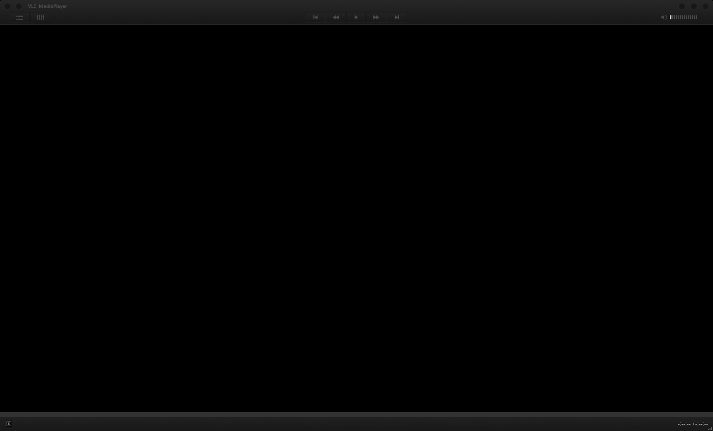
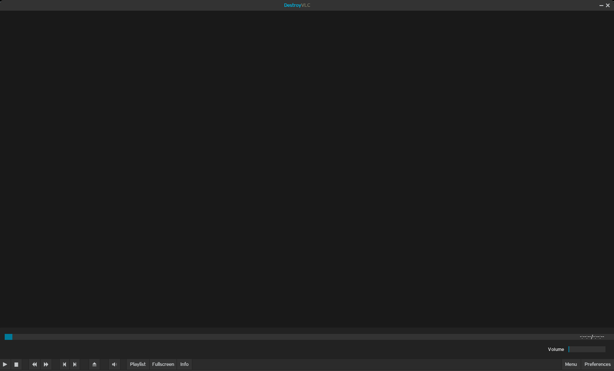
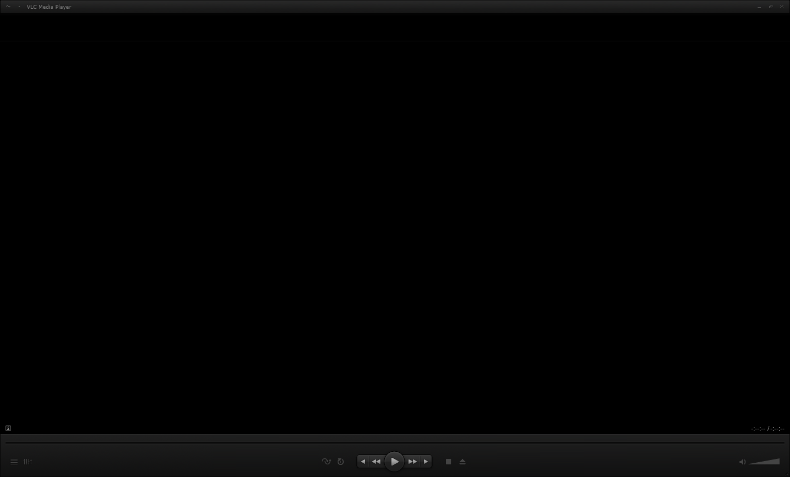

# How Install **VLC** Themes

## Best Themes

* Before installing any theme **select** witch one is the one is the **more** visually **appealing** **for you**.
* So in here I will show you the **list** of the **best themes** in **my opinion**.

### Minimal X

* If interested just **click** on the **image**:

### Skyfire

* If interested just **click** on the **image**:

### Dark Lounge

* If interested just **click** on the **image**:

### Destroy VLC

* If interested just **click** on the **image**:

### VLT Deep Dark

* If interested just **click** on the **image**:

## Second Step: Installation

After **selecting** the **best** theme **for you** and **downloading it** the next move is **install it**:

* Just **open VLC** and **click** with the **right** button **on** the **blank** screen;
* Then **Tools** -> **Preferences** (or just **CTRL + P**);
* Afterward **check** "**Use custom skin**”;
* Click on "**Choose…**” button and **select** the **.vlt** theme file **which may** or **may not** be **in** a **compressed** file.

# Now **return** to the **main page** by [**clicking here**](https://github.com/gabrielzschmitz/Elementary-OS-Perfect-Install).
