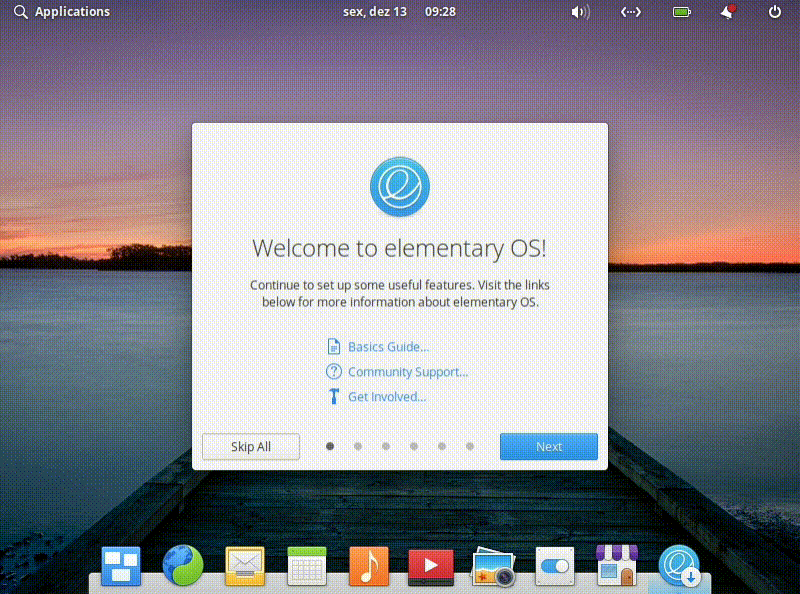

# If you want to make an Dual Boot with Windows

* **Only** install the Windows 10, the others apparently are not recognized anymore;
* Install it **Before** the Elementary OS.

# Get the System

**Download** or **purchase** Elementary OS from here: [Elementary OS](https://elementary.io/)

# Get the Bootable Pen Drive

You can use [Rufus](https://rufus.ie/), [Universal USB Installer](https://www.pendrivelinux.com/universal-usb-installer-easy-as-1-2-3/), or [Image Burner](https://appcenter.elementary.io/com.github.artemanufrij.imageburner/), but I prefer to
use **Etcher** to that, and you can download it from here: [Balena Etcher](https://www.balena.io/etcher/)

## How to use Balena Etcher

* After install just open it;
* Select the system iso;
* The right pen drive and click "Flash!";
* Wait until the process end and then close the program.

# Configure the BIOS and Start Formatting

* Now **shut down** your computer;
* **Plug** your **pen drive** and **acess** the **BIOS**, usually its by pressing **F2, F10, F11 or DEL**.
  But if that dont work for you search for your motherboard or laptop model and see how do you get into the BIOS.

## Disable Secure Boot

* Already in the BIOS if your **PC is old** you need to **disable the secure boot**,but if not you can jump to the next
  step.

## Change Boot Order

* Browse through the BIOS and make sure that your **USB is the first of boot order**;
* Then just **save the config** and restart the computer with the **USB plugged** and the logo of Elementary Os will blink
  in your screen.

# Start Installation

## 1-

* If you want a video about how to install just [click here](https://www.youtube.com/watch?v=SOCVFD8vanA) or for Dual Boot
  install [click here](https://youtu.be/pBZzW_Rx3CU) ([credits to me](https://www.youtube.com/channel/UCsMUlVzRNZNPyPtSVygoPUQ));
* But if not let me explain you how, once it boots in to formatting screen, you’ll be provided to **"Try elementary"** or
  **"Install elementary"** and on left the **language** of the system. No need to tell you what to do here.

## 2-

* Select the **keyboard layout**.

## 3-

* Check the **two boxes** an then click **"Continue"**.

## 4-

* If you will **only** install Elementary OS check **"Erase disk and install elementary"**;
* But if you will make a **Dual Boot** click on **"Install elementary alongside (the other system)"** and after the choice
  click on **"Continue"**.

## 5.1-

* Choosing to erase disk and install elementary this pop-up will appear to advise that you will lose all the data and
  partitions of your HD. So with that on mind click **"Continue"**.

## 5.2-

* Choosing to install alongside other system the other step is slice your HD/SSD with this bar. Just divide how much of your
  space will be use to the 2 system by moving this bar;
* **Tip:** if you are using Elemetary OS just to learn how it works something between 20 and 50GB is more than enough.

## 6-

* **Regardless of which step 5** you chose the other screen will be that and here the only thing you need **fill** is in
  witch **timezone** you are, but normally it will be detected automatically.

## 7-

* Next you just need to **fill** with your **personal information**;
* **Tip:** for the password try to choose something with **at most 8 or 10** characters cause you will need to write this a
  lot of times in the terminal, app center and many others.

## 8-

* Now its all done, **just wait**.

## After all, just **read** the **"Get Started"**.

* Read and select the proper options.

# Now **return** to the **main page** by [**clicking here**](https://github.com/gabrielzschmitz/Elementary-OS-Perfect-Install).
