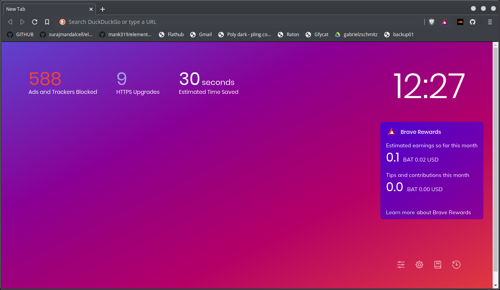
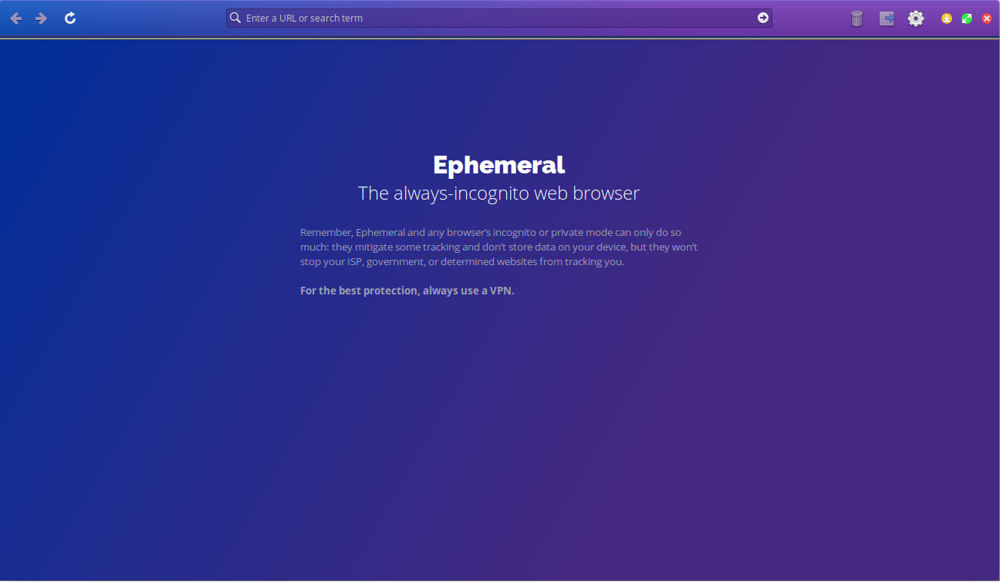

# Summary:

* [Chrome](https://github.com/gabrielzschmitz/Elementary-OS-Perfect-Install/blob/master/How-Install-your-Favorite-Browser.md#chrome): the most used browser around the world;
* [Firefox](https://github.com/gabrielzschmitz/Elementary-OS-Perfect-Install/blob/master/How-Install-your-Favorite-Browser.md#firefox): to people that dont want to give money to Google;
* [Brave](https://github.com/gabrielzschmitz/Elementary-OS-Perfect-Install/blob/master/How-Install-your-Favorite-Browser.md#brave): a very respectful of privacy browser based in Chromium;
* [Opera](https://github.com/gabrielzschmitz/Elementary-OS-Perfect-Install/blob/master/How-Install-your-Favorite-Browser.md#opera): other Chromium based browser with alot of factory features;
* [Ephemeral](https://github.com/gabrielzschmitz/Elementary-OS-Perfect-Install/blob/master/How-Install-your-Favorite-Browser.md#ephemeral): the always-incognito browser of Elementary OS developers team.

### Chrome

Google Chrome is one of the best internet browsers because it is easy to use and secure, and it syncs your preferences and bookmarks across multiple devices. However, Chrome is slow 
compared to other browsers, and it comes in a large file.


* Commands:

```
wget -q -O - https://dl-ssl.google.com/linux/linux_signing_key.pub | sudo apt-key add -
sudo sh -c 'echo "deb http://dl.google.com/linux/chrome/deb/ stable main" >> /etc/apt/sources.list.d/google-chrome.list'
sudo apt-get update
sudo apt-get install google-chrome-stable
```

* Easy copy and paste:

```
wget -q -O - https://dl-ssl.google.com/linux/linux_signing_key.pub | sudo apt-key add - && sudo sh -c 'echo "deb http://dl.google.com/linux/chrome/deb/ stable main" >> /etc/apt/sources.list.d/google-chrome.list' && sudo apt-get update ; sudo apt-get install google-chrome-stable
```

### FireFox

Mozilla Firefox is a versatile, feature-rich browser that’s good for both casual browsing and intensive research. It also does a good job of blocking phishing schemes and malware 
downloads.


* Commands:

```
sudo add-apt-repository ppa:mozillateam/firefox-next
sudo apt update
sudo apt upgrade
sudo apt install firefox
```

* Easy copy and Paste:

```
sudo add-apt-repository ppa:mozillateam/firefox-next && sudo apt update ; sudo apt upgrade ; sudo apt install firefox
```

### Brave

Brave is a web browser which seeks to treat each user as an individual, instead of a “product.” Created by Brendan Eich, one of the originators of the popular Mozilla browser, it seeks to 
go well beyond Firefox in terms of security and privacy, while retaining its speed and ease of use.  Founded on open source software, Brave is completely free to use (and has a 
commitment to remain so for the foreseeable future). It’s also ad-free if users prefer, just as you’d hope from a secure browser.



* Commands:

```
sudo apt install apt-transport-https curl
curl -s https://brave-browser-apt-release.s3.brave.com/brave-core.asc | sudo apt-key --keyring /etc/apt/trusted.gpg.d/brave-browser-release.gpg add -
echo "deb [arch=amd64] https://brave-browser-apt-release.s3.brave.com/ stable main" | sudo tee /etc/apt/sources.list.d/brave-browser-release.list
sudo apt update
sudo apt install brave-browser
```

* Easy copy and Paste:

```
sudo apt install apt-transport-https curl ; curl -s https://brave-browser-apt-release.s3.brave.com/brave-core.asc | sudo apt-key --keyring /etc/apt/trusted.gpg.d/brave-browser-release.gpg add - && echo "deb [arch=amd64] https://brave-browser-apt-release.s3.brave.com/ stable main" | sudo tee /etc/apt/sources.list.d/brave-browser-release.list && sudo apt update ; sudo apt install brave-browser
```

### Opera

It isn’t compatible with some older websites, but Opera is a secure, fast and feature-rich internet browser worthy of consideration.


* For Opera you need to install Snapcraft too if you dont had installed (already in the commands from main page):
* Their site: https://snapcraft.io/store or [click here](https://snapcraft.io/store);
* Opera in Snapcraft: https://snapcraft.io/install/opera/elementary or [click here](https://snapcraft.io/install/opera/elementary);

```
sudo apt update
sudo apt install snapd
sudo snap install opera
```

If you alrady had installed just use the last command (sudo snap install opera)
* Easy copy and paste (if  snap is not installed):

```
sudo apt update ; sudo apt install snapd && sudo snap install opera
```

### Ephemeral

Browse the Internet in private without leaving a trace of history on your computer. Ephemeral is a stripped down private browser that's perfect for avoiding persistent cookies or web 
trackers. Close the window and all traces of your browsing are removed from your device.



* Just search in App Center
* Or use the Elementary Os App Center in browser by there: https://appcenter.elementary.io/com.github.cassidyjames.ephemeral/  or clicking [here](https://appcenter.elementary.io/com.github.cassidyjames.ephemeral/) 
