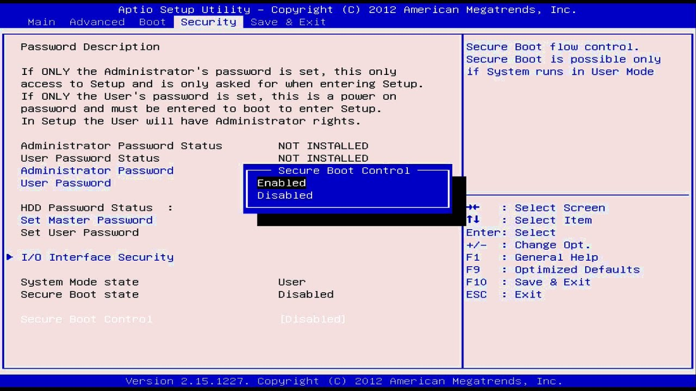
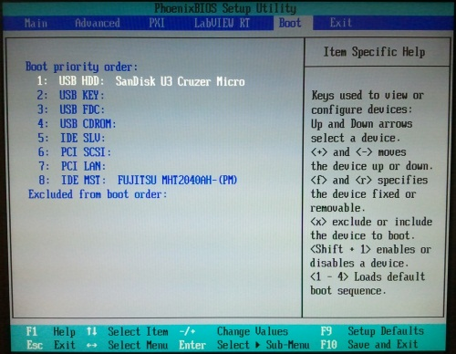
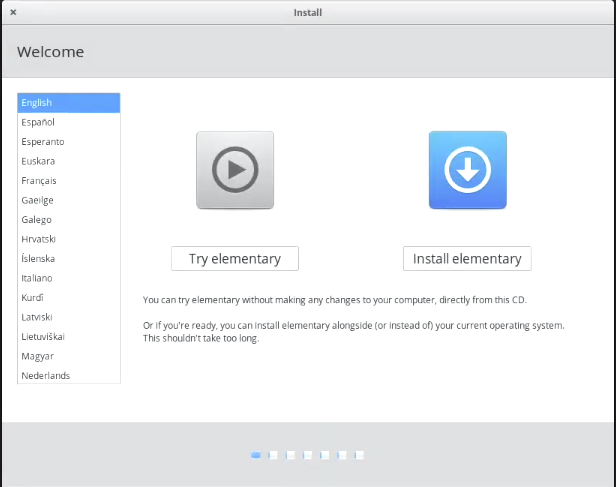

# How to Make the Perfect Elementary OS Install

In this article I will try to instruct you about how to install, update, personalize and install the essencial programs in
Elementary OS 5.1 Hera.

## Disclaimer

Before of all if you will use a Dual Boot with Windows install Windows 10, the other versions are apparently not more supported
(I had tested with Windows 8.1). When i use an [blue link like that](https://corgiorgy.com/) click with ctrl to open in a new 
tab and dont close this article.

## Get the System

Download or purchase Elementary OS from here: [Elementary OS](https://elementary.io/)

## Get the Bootable Pen Drive
You can use Rufus, Universal USB Installer, or Image Burner, but I prefer to use Etcher to that, and you can download it from
here: [Balena Etcher](https://www.balena.io/etcher/)

### How to use Balena Etcher

After install just open it, select the system iso, the right pen drive and click "Flash!". Wait until the process end and then 
close the program.

## Configure the BIOS and Start Formatting

Now shut down your computer, plug your pen drive and acess the BIOS, usually its by pressing F2, F10, F11 or DEL.
But if that dont work for you search for your motherboard or laptop model and see how do you get into the BIOS.

### Disable Secure Boot

Already in the BIOS if your PC is old you need to disable the secure boot,but if not you can jump to the next step.

### Change Boot Order

Browse through the BIOS and make sure that your USB is the first of boot order.
Now just save the config and restart the computer with the USB plugged and the logo of Elementary Os will blink in your
screen.

## Start Installation

If you want a video about how to install [click here](https://www.youtube.com/watch?v=S7bKOK9m3tM). But if not let me explain 
how to install, once it boots in to formatting screen, you’ll be provided to "Try elementary" or "Install elementary". No 
need to tell you what to do here.

