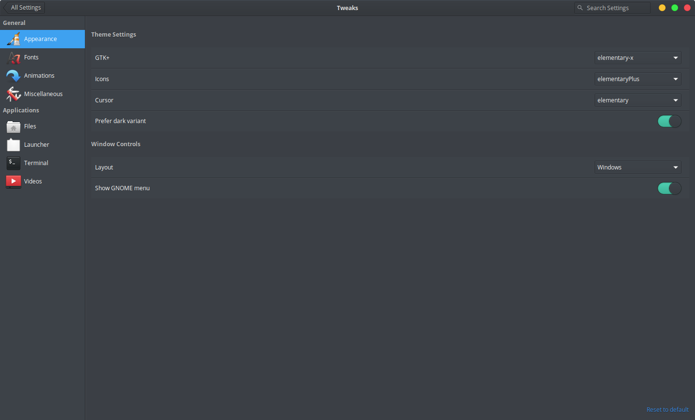
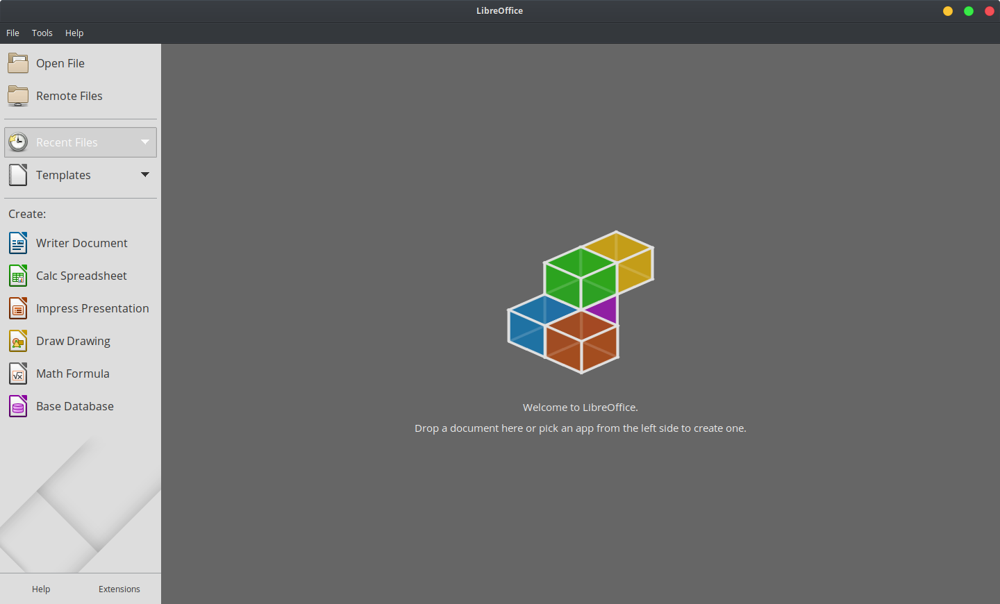
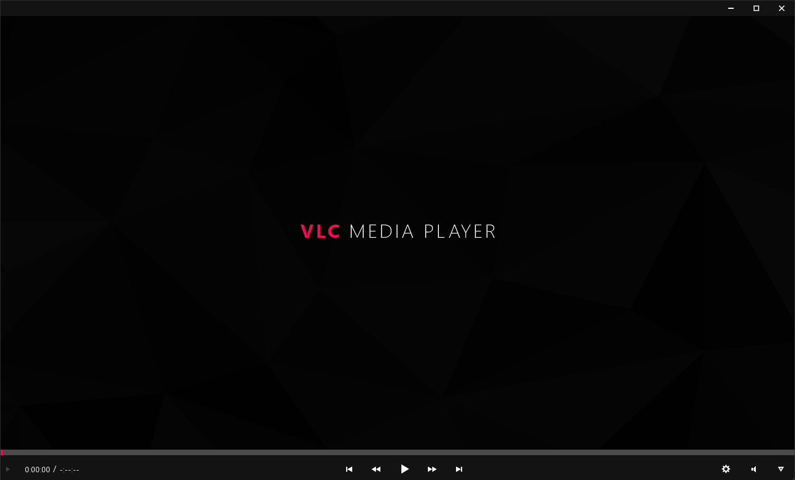
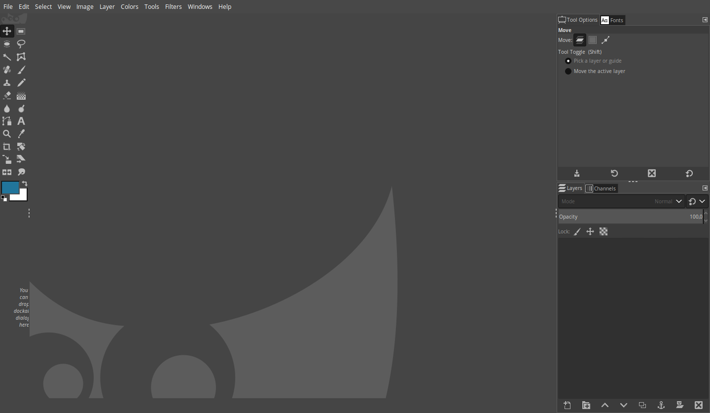
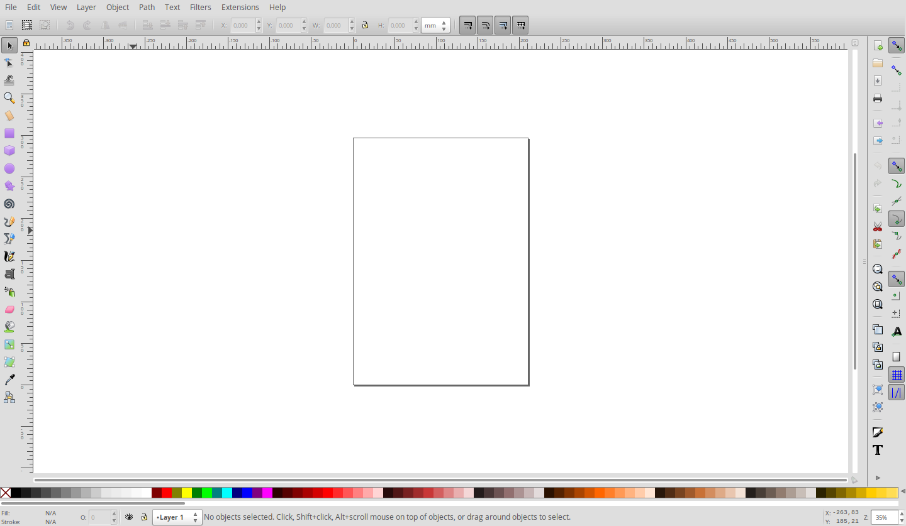
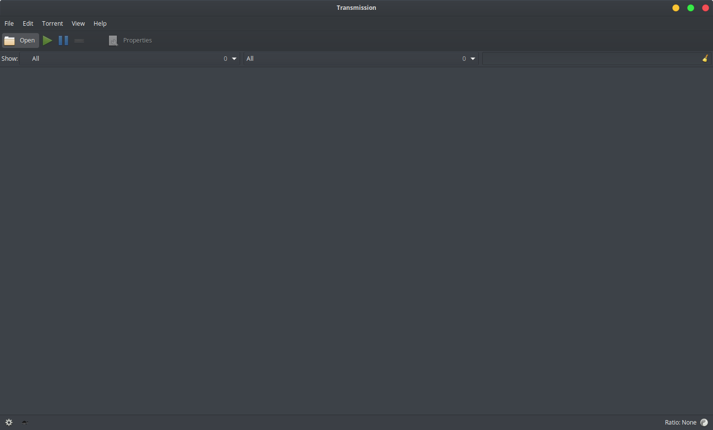
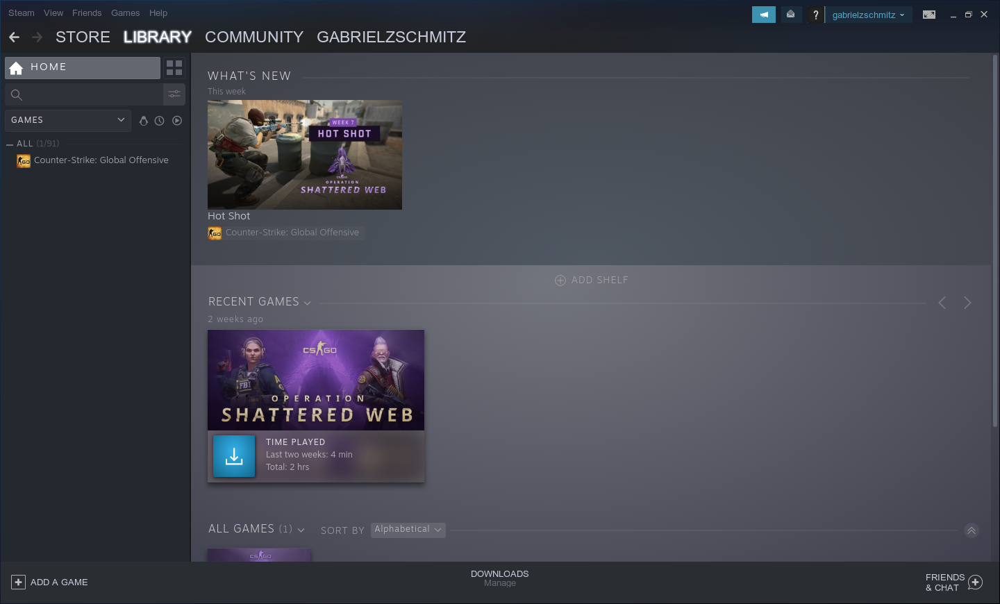
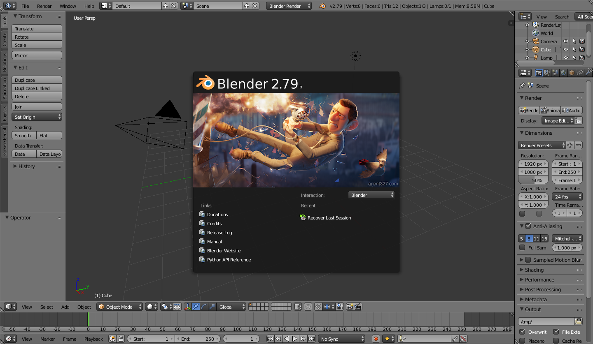
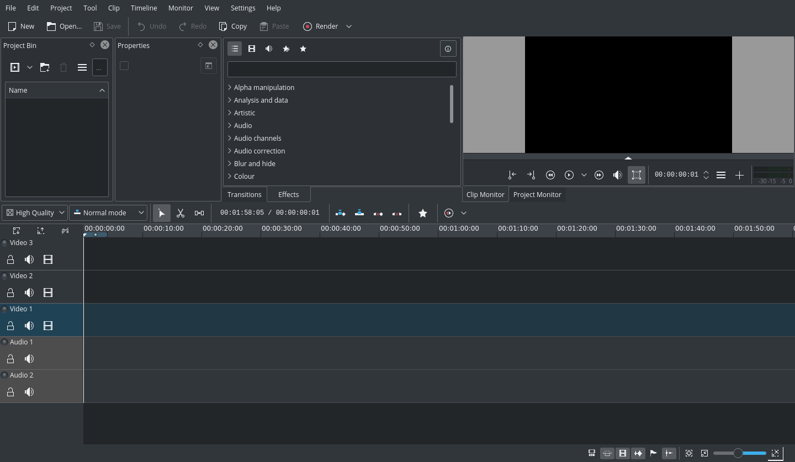
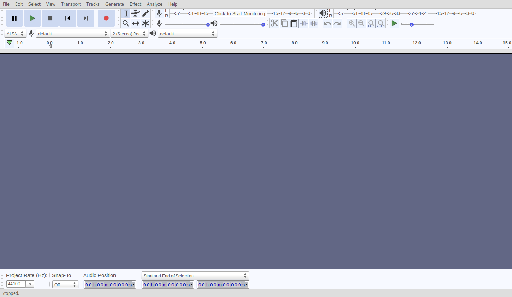

# How to Make the Perfect Elementary OS Install

In this article I will try to instruct you about **how** to **install**, **update**, **personalize**, install the **essential programs** and **programs recommendations** in **Elementary OS 5.1 Hera**.

### Disclaimer

* When i use an [**blue link like that**](https://corgiorgy.com/) a tip is **click** with **ctrl** to open in a new tab and **don’t close** this article.
* **Notify me** if you find any **grammatical errors**. My English is not one of the best yet.

## How to install the system

* **Just [click here](https://github.com/gabrielzschmitz/Elementary-OS-Perfect-Install/blob/master/How-Install-the-System.md) to read and to access videos about it.**

## After Install Lets Configure It:

Just **copy and paste**

  ```
  The **commands** from **this boxes**
  ```

to the **Elementary terminal**

* **Disclaimer:** **"&&"** its **logical operator** that **execute** the **other** command **only** if the **previous** was **successfully** executed and **";"** to execute the **next command regardless** of the **success** of the **previous** command. So I have used that to **make** the **copy and paste faster, but I you display all the commands separately too**.

### Update the System

* The **first** thing to do **after** a fresh **install** is to **check** if the system have any **update**:

```
sudo apt-get update
sudo apt-get upgrade
sudo apt dist-upgrade
```

* Easy **copy and paste**:

```
sudo apt-get update && sudo apt-get upgrade && sudo apt dist-upgrade sudo apt update && sudo apt upgrade
```

### Enable PPA

* For security the **Elementary** have **PPA’s disabled** by default, but we gonna need they to **install** a lot of **programs**. Do not worry the PPA’s are disabled **more because** of the** distro purposes than** for **lack** of **security**.

```
sudo apt-get install software-properties-common
```

### Update Git

* **Git** is a distributed **version-control** system for **tracking changes** in **source code** **during software development**. But it **can** be **used**** by **non programmers** to **download** and **clone** projects **from github**.

```
sudo apt-get install git
```

### Install Snapcraft

* **Snap** is basically one of the **app stores** **for linux** that provide you a **long catalog** of **applications** being **required to** download some **items in** this **article**.

```
sudo apt update
sudo apt install snapd
```

* Easy **copy and paste**:

```
sudo apt update ; sudo apt install snapd
```

### Get your Favorite Browser

**For** a guide to **how install all** [**click here**](https://github.com/gabrielzschmitz/Elementary-OS-Perfect-Install/blob/master/How-Install-your-Favorite-Browser.md) or **directly click** in **your favorite**:

* [**Chrome**](https://github.com/gabrielzschmitz/Elementary-OS-Perfect-Install/blob/master/How-Install-your-Favorite-Browser.md#chrome): the **most used browser** around the world;
* [**Firefox**](https://github.com/gabrielzschmitz/Elementary-OS-Perfect-Install/blob/master/How-Install-your-Favorite-Browser.md#firefox): to people that **don't** want to **give money** to **Google**;
* [**Brave**](https://github.com/gabrielzschmitz/Elementary-OS-Perfect-Install/blob/master/How-Install-your-Favorite-Browser.md#brave): a very **privacy-respect** browser **based** in **Chromium**;
* [**Opera**](https://github.com/gabrielzschmitz/Elementary-OS-Perfect-Install/blob/master/How-Install-your-Favorite-Browser.md#opera): other **Chromium based** browser with a lot of **factory features**;
* [**Ephemeral**](https://github.com/gabrielzschmitz/Elementary-OS-Perfect-Install/blob/master/How-Install-your-Favorite-Browser.md#ephemeral): the **always-incognito** browser of **Elementary OS** developers **team**.

## If you are using a dual boot

* Install [**Grub Customizer**](https://launchpad.net/grub-customizer) to , how the name says, **customize Grub**, that is the **menu** to **select** the **operating system** to boot.

```
sudo add-apt-repository ppa:danielrichter2007/grub-customizer
sudo apt-get update
sudo apt-get install grub-customizer
```

* Easy **copy and paste**:

```
sudo add-apt-repository ppa:danielrichter2007/grub-customizer && sudo apt-get update ; sudo apt-get install grub-customizer
```

* After install a good idea is to **rename** the **“Windows Boot Loader”** **to** **“Windows”** or **“Windows 10”** and **change** the default **Elementary name to** **“Elementary OS”**. And maybe if you **don't like** the default **look of Grub** **download a theme from [Gnome Look](https://www.gnome-look.org/browse/cat/109/)**.

### Install File Compression Libs

* To be **able to extract or compress** all files that you want is good to **install** the **file compression libs** using this commands:

```
sudo apt-get install unace unrar zip unzip xz-utils p7zip-full p7zip-rar sharutils rar uudeview mpack arj cabextract file-roller
```

### Install Elementary Tweaks to personalize

* A **theme manager** is **missing** in **Elementary**, but by installing **Elementary Tweaks** you can use both themes and various visual options.
* **After install** a **Tweaks** tab will appear in **system options**.



```
sudo add-apt-repository ppa:philip.scott/elementary-tweaks
sudo apt-get update
sudo apt-get install elementary-tweaks
```

* Easy **copy and paste**:

```
sudo add-apt-repository ppa:philip.scott/elementary-tweaks && sudo apt-get update ; sudo apt-get install elementary-tweaks
```

# Install Useful Programs (Only what you need)

### Install an Office Suite

* **Microsoft Office** is **not available for Linux** so the best alternative to install is **Libre Office** an **open-source** project that have the **same functionalities** of **Microsoft** product, but for **free**,  you just **need** to **adaptable**.



* You can **install** by terminal **with this command**:

```
sudo apt install libreoffice
```

#### Install VLC

* **VLC** is the **best video player** for basically all the **operational system** and to **Linux** is **not different**.



```
sudo apt install vlc
```

* For **how to** make **VLC look like mine** and get a **list of** the **best themes** [click here](https://github.com/gabrielzschmitz/Elementary-OS-Perfect-Install/blob/master/Best-VLC-Themes-and-How-Install-it.md)

#### Install GIMP

* For **GIMP** just **download it** from [**GIMP**](https://www.gimp.org/downloads/) site by clicking in **"Install GIMP flatpak"**;
* **After** **the download open** the **.flatpakref**;
* **Wait** to the **informations** be loaded;
* **Check** the **"I understood"** box and **click install**;
* **After that** just **wait** the program **be downloaded and installed**.

##### To make GIMP more like Photoshop

* If you're **more used** to **Photoshop** or if you think that is prettier I recommend you to **install PhotoGIMP** a **Brazilian GIMP modification** to **make** the **GIMP** experience more **like Photoshop**.
* You can **install it** using [snap](https://snapcraft.io/photogimp):



```
sudo snap install photogimp
```

#### Install Inkscape

* As **like GIMP**, **Inkscape is** a **Linux free** and **open-source** **vector** graphics **editor** **alternative to Illustrator**. For **Inkscape** you'll **need** to **add** they **PPA** and **then** just use **apt-get install**:



```
sudo add-apt-repository ppa:inkscape.dev/stable
sudo apt-get update
sudo apt-get install inkscape
```

* Easy **copy and paste**:

```
sudo add-apt-repository ppa:inkscape.dev/stable && sudo apt-get update ; sudo apt-get install inkscape
```

#### Install Multimedia Codecs

* To be **able** to **open all media codecs**, **watch** and **listen** all your **files** you'll need to **install** this 3 **multimidia codecs**.

```
sudo apt install ubuntu-restricted-extras
sudo apt install libavcodec-extra
sudo apt install libdvd-pkg
```

* Easy **copy and paste**:

```
sudo apt install ubuntu-restricted-extras ; sudo apt install libavcodec-extra ; sudo apt install libdvd-pkg
```

#### Install Transmission (Torrent Application)



```
sudo apt-get install transmission
```

#### Install Steam



```
sudo apt install steam
```

#### Install Wine to install Windows programs


```
sudo apt install wine-stable
```

#### Install Blender (3D Editor)



```
sudo apt install blender
```

#### Install Kdenlive (Basic Video Editor)



```
sudo apt-get install kdenlive
```

* For dark theme:

```
sudo apt install kde-runtime
```

#### Install Audacity (Audio Editor)



```
sudo apt install audacity
```

#### Install Soundnode (Souncloud Desktop Client)

* Commands:

```
curl -s https://packagecloud.io/install/repositories/JonasGroeger/soundnode/script.deb.sh | sudo os=ubuntu dist=xenial bash
sudo apt-get update
sudo apt-get install soundnode

```

* Easy **copy and paste**:

```
curl -s https://packagecloud.io/install/repositories/JonasGroeger/soundnode/script.deb.sh | sudo os=ubuntu dist=xenial bash && sudo apt-get update ; sudo apt-get install soundnode
```

### Best Apps from App Center

* Best Email Client – Thunderbird
* Best Free Office Suite – Libre Office (previously installed)
* Best Password Manager – Dashlane (Just Add to the Browser)
* Best Partition Manager – Gparted
* Best PDF Editor – Libre Office Draw
* Best Screen Recorder – OBS
* Best Torrent Client – Transmission
* Best FTP Client – FileZilla
* Best Note Taking App – Notes-up
* Best Video Editing Software – Kdenlive (for **basic** edits, previously installed)Davinci Resolve (for Advanced Edits, download from them site [here](https://www.blackmagicdesign.com/products/davinciresolve/))
* Best Download Manager – uGet
* Best Video Players – VLC
* Best Google Drive Client – VGrive
* Best Media Server Software – Kodi
* Best Cloud Storage – OwnCloud

### Clean System

```
sudo apt-get autoclean
sudo apt-get clean
sudo apt-get autoremove
```
