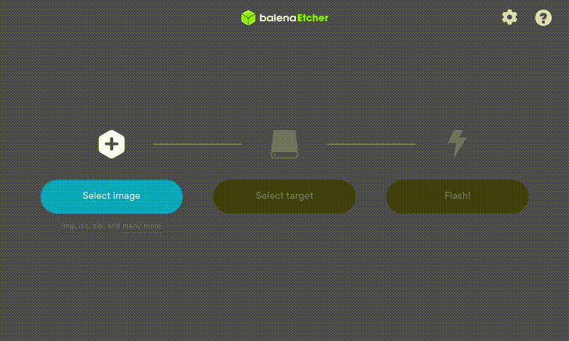

# How to Make the Perfect Elementary OS Install

In this article I will try to instruct you about how to install, update, personalize and install the essencial programs in
Elementary OS 5.1 Hera.

## Disclaimer

Before of all if you will use a Dual Boot with Windows install Windows 10, the other versions are apparently not more supported
(I had tested with Windows 8.1), and sorry by the bad English.

## Get the System

Download or purchase Elementary OS from here:

```
[https://elementary.io/](https://elementary.io/)
```

## Get the Bootable Pen Drive
You can use Rufus, Universal USB Installer, or Image Burner, but I prefer to use Etcher to that, and you can download it from
here:

```
https://www.balena.io/etcher/
```
### How to use Balena Etcher

After install just open it, select the system iso, the right pen drive and click "Flash!". Wait until the process end and then 
close the program.


