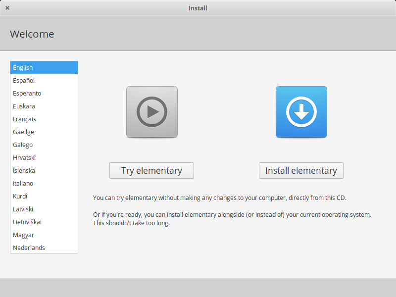
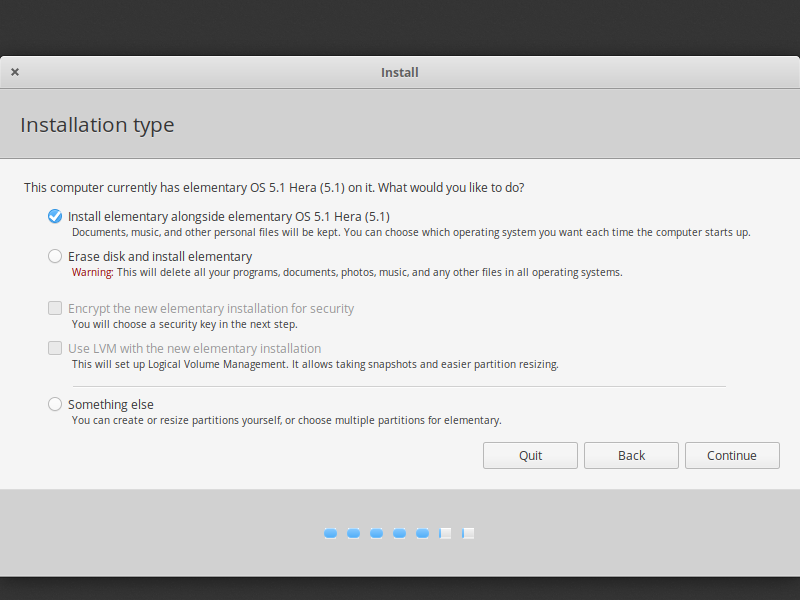
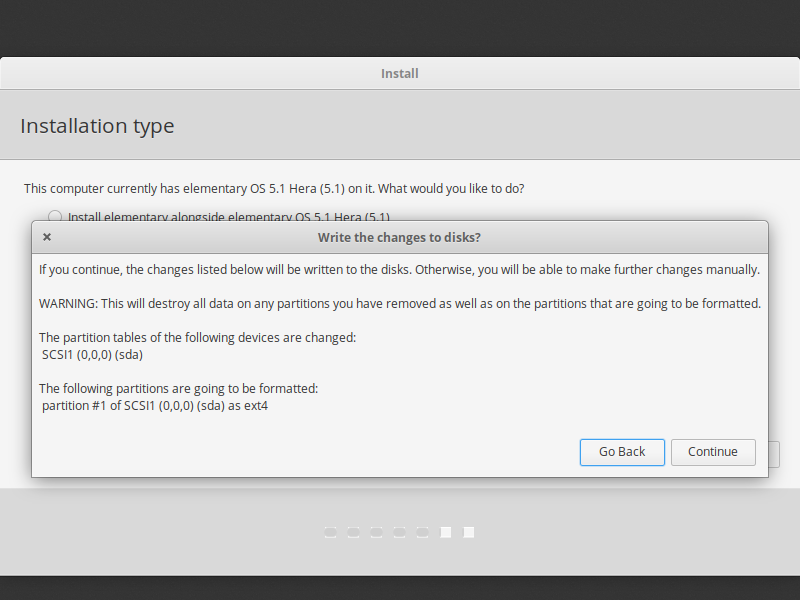
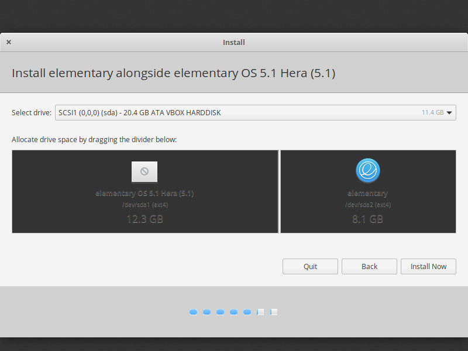
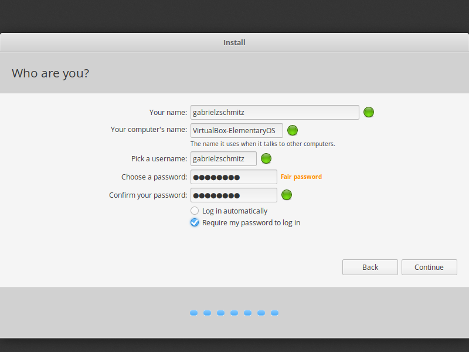

# How to Make the Perfect Elementary OS Install

In this article I will try to instruct you about how to install, update, personalize and install the essencial programs in
Elementary OS 5.1 Hera.

## Disclaimer

Before of all if you will use a Dual Boot with Windows install Windows 10, the other versions are apparently not more 
supported (I had tested with Windows 8.1). When i use an [blue link like that](https://corgiorgy.com/) click with ctrl to 
open in a new tab and dont close this article.

## [If you already installed the system click here to skip this step](https://github.com/gabrielzschmitz/Elementary-OS-Perfect-Install/blob/master/README.md#first-just-read-the-get-started)

## Get the System

Download or purchase Elementary OS from here: [Elementary OS](https://elementary.io/)

## Get the Bootable Pen Drive
You can use Rufus, Universal USB Installer, or Image Burner, but I prefer to use Etcher to that, and you can download it 
from here: [Balena Etcher](https://www.balena.io/etcher/)

### How to use Balena Etcher

After install just open it, select the system iso, the right pen drive and click "Flash!". Wait until the process end and 
then close the program.


## Configure the BIOS and Start Formatting

Now shut down your computer, plug your pen drive and acess the BIOS, usually its by pressing F2, F10, F11 or DEL.
But if that dont work for you search for your motherboard or laptop model and see how do you get into the BIOS.

### Disable Secure Boot

Already in the BIOS if your PC is old you need to disable the secure boot,but if not you can jump to the next step.


### Change Boot Order

Browse through the BIOS and make sure that your USB is the first of boot order.
Now just save the config and restart the computer with the USB plugged and the logo of Elementary Os will blink in your
screen.


## Start Installation

### 1-
If you want a video about how to install [click here](https://www.youtube.com/watch?v=S7bKOK9m3tM) (credits to 
[Riba Linux](https://www.youtube.com/user/TheRibalinux)). But if not let me explain you how, once it boots in to 
formatting screen, you’ll be provided to "Try elementary" or "Install elementary" and on left the lenguage of the system. No 
need to tell you what to do here.



### 2-

Select the keyboard layout.


### 3-

Check the two boxes an then click "Continue".


### 4-

If you will install the only Elementary OS check "Erase disk and install elementary" but if you will make a Dual Boot click 
on "Install elementary alongside (the other system)" and after the choice click on "Continue".



### 5.1-

Choosing to erase disk and install elementary this pop-up will appear to advise that you will lose all the data and 
partitions of your HD. So with that on mind click "Continue".



### 5.2-

Choosing to install alongside other system the other step is slice your HD/SSD with this bar. Just divide how much of your 
space will be use to the 2 system. Tip: if you are using Elemetary OS just to learn how it works something between 20 and 
50GB is more than enough.



### 6-

Regardless of which step 5 you chose the other screen will be that and here the only thing you need fill is in witch 
timezone, but normally it will detect alone.


### 7-

Next you just need to fill with your personal information. Tip for the password try to choose something with at most 8 or 10 
characters cause you will need to write this a lot of times in the terminal, app center and many others.



### 8-

Now its all done, just wait.


# Now lets configure it

## First, just read the "Get Started"


## Update the system ##

```
sudo apt-get update && sudo apt-get upgrade && sudo apt dist-upgrade
```

## Enable PPA

```
sudo apt-get install software-properties-common
```

## Install Elementary Tweaks to personalize

```
sudo add-apt-repository ppa:philip.scott/elementary-tweaks

sudo apt-get update

sudo apt-get install elementary-tweaks
```

## Install Office Suite (Libre Office)

```
sudo apt install libreoffice
```

## Install Firefox

```
sudo apt install firefox
```

## Install Chrome

```
sudo apt install chrome
```

## Install Brave 

```
sudo apt install apt-transport-https curl

curl -s https://brave-browser-apt-release.s3.brave.com/brave-core.asc | sudo apt-key --keyring /etc/apt/trusted.gpg.d/brave-
browser-release.gpg add -

echo "deb [arch=amd64] https://brave-browser-apt-release.s3.brave.com/ stable main" | sudo tee 
/etc/apt/sources.list.d/brave-browser-release.list

sudo apt update

sudo apt install brave-
```

## Install VLC

```
sudo apt install vlc
```

## Install Gimp and Inkscape

```
sudo apt install gimp

sudo apt install inkscape
```

## Install Multimidea Codecs

```
sudo apt install ubuntu-restricted-extras

sudo apt install libavcodec-extra

sudo apt install libdvd-pkg
```

## Install Java

```
sudo add-apt-repository -y ppa:webupd8team/java

sudo apt-get update

sudo apt-get install oracle-java9-installer
```

## Install Archieve Formats

```
sudo apt-get install unace rar unrar p7zip-rar p7zip sharutils uudeview mpack arj cabextract lzip lunzip
```

## Install Transmission (Torrent Application)

```
sudo apt-get install transmission
```

## Install Steam

```
sudo apt install steam
```

## Install Wine to install Windows programs

```
sudo apt install wine-stable
```

## Install Blender (3D Editor)

```
sudo apt install blender
```

## Install Kdenlive (Basic Video Editor)

```
sudo apt-get install kdenlive
```

## Install Audacity (Audio Editor)

```
sudo apt install audacity
```

## Best Apps from App Center

* Best Email Client – Thunderbird
* Best Free Office Suite – LibreOffice (previously installed)
* Best Password Manager – Dashlane(Just Add to the Browser)
* Best Partition Manager – Gparted
* Best PDF Editor – LibreOffice Draw
* Best Screen Recorder – OBS
* Best Torrent Client – Transmission
* Best FTP Client – FileZilla
* Best Note Taking App – Notejot
* Best Video Editing Software – Kdenlive (for Basic Edits, previously installed)Davinci Resolve (for Advanced Edits, 
download from them site)
* Best Download Manager – uGet
* Best Video Players – VLC
* Best Google Drive Client – VGrive
* Best Web Browser – Chromium or Google Chrome
* Best Media Server Software – Kodi
* Best Cloud Storage – OwnCloud

## Clean System

```
sudo apt-get autoclean

sudo apt-get clean

sudo apt-get autoremove
```
